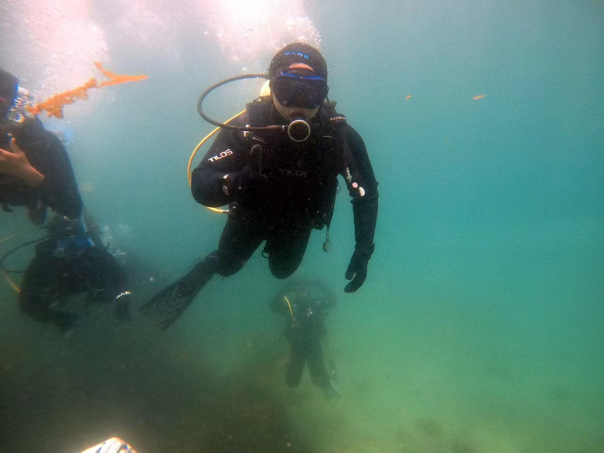
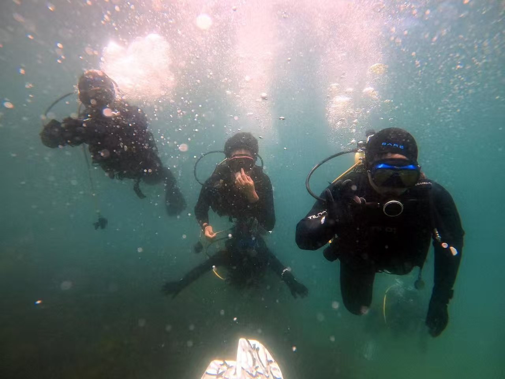
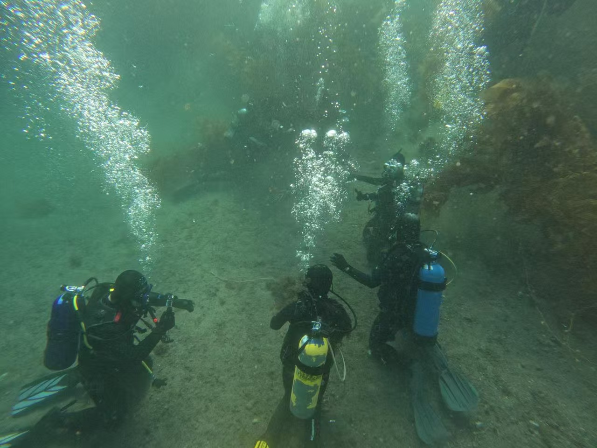
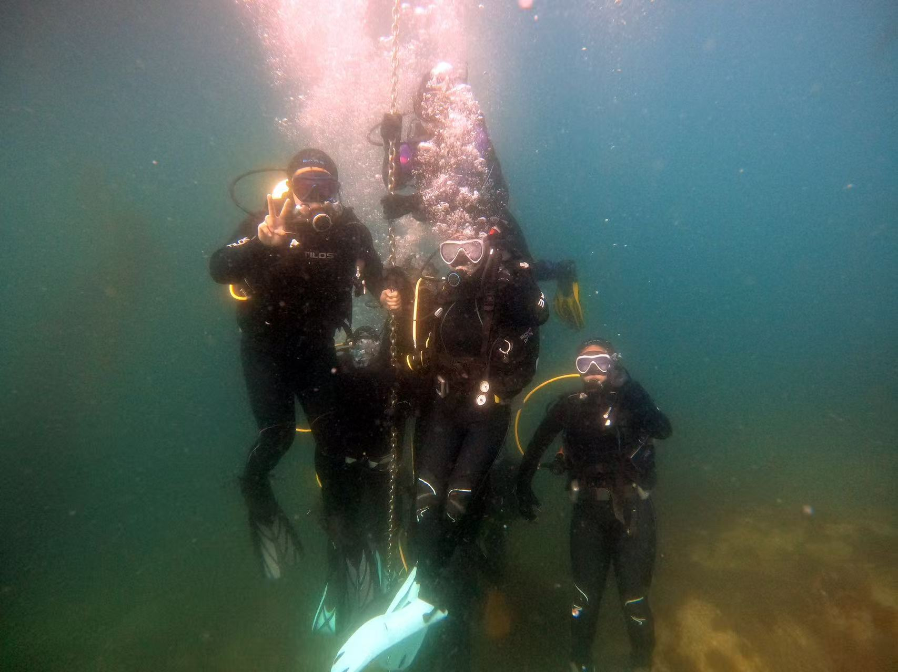
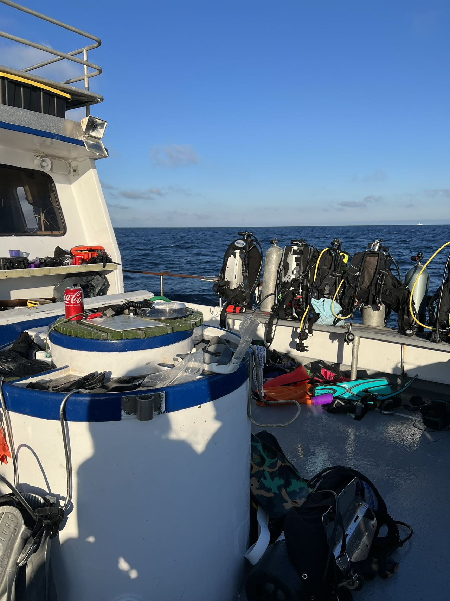

During high school I trained and served as a **PADI-Certified Rescue Diver** specialties in **AWARE Dive Against Debris**, participating in **year-round underwater marine clean-up dives** to protect local coastal ecosystems. On these dives, our group **removed more than 300 lbs of debris** — including fishing lines, nets, plastics, and dock materials — to reduce entanglement risks for marine life.

I also completed **three American Red Cross certifications** — **First Aid**, **CPR/AED**, and **Lifeguard/Water Safety** — and worked as a **summer lifeguard at Northpark Community Aquatics** (~4 hrs/week, ~30 weeks/year). This let me contribute both **in the water (diving)** and **at the surface (public safety).**

- **Position/Leadership (≤50):** PADI-Certified Advanced Open Water / Rescue Diver  
- **Organizations:** PADI; American Red Cross; Northpark Community Aquatics  
- **Participation:** Grades **9, 10, 11, 12** — **All Year**  
- **Hours:** ~4 hrs/week × 30 weeks/year  

---

## Dive Photos

<figure style="margin: 2rem 0;">
  
  <figcaption style="text-align: center; margin-top: 1rem; font-style: italic; color: #666;">
    Debris-removal dive with team — practicing PADI rescue skills and buddy checks.
  </figcaption>
</figure>

<figure style="margin: 2rem 0;">
  
  <figcaption style="text-align: center; margin-top: 1rem; font-style: italic; color: #666;">
    Buddy dive in low visibility while collecting lines and plastic fragments.
  </figcaption>
</figure>

<figure style="margin: 2rem 0;">
  
  <figcaption style="text-align: center; margin-top: 1rem; font-style: italic; color: #666;">
    Removing debris from the seafloor to protect fish, invertebrates, and eelgrass habitat.
  </figcaption>
</figure>

<figure style="margin: 2rem 0;">
  
  <figcaption style="text-align: center; margin-top: 1rem; font-style: italic; color: #666;">
    Team formation before ascent — practicing controlled surfacing and safety stops.
  </figcaption>
</figure>

<figure style="margin: 2rem 0;">
  
  <figcaption style="text-align: center; margin-top: 1rem; font-style: italic; color: #666;">
    Surface prep and gear check — loading equipment before the clean-up dive.
  </figcaption>
</figure>

---

## Dive Video

<figure style="margin: 2rem 0;">
  <video src="DiveVideo.mp4" controls style="width: 100%; max-width: 900px; display: block; margin: 0 auto; border-radius: 8px; box-shadow: 0 8px 18px rgba(0,0,0,0.12);"></video>
  <figcaption style="text-align: center; margin-top: 1rem; font-style: italic; color: #666;">
    Underwater footage from the clean-up dive — shows visibility, teamwork, and debris collection.
  </figcaption>
</figure>

---

## Activity Version (150 chars)

**Led marine clean-up dives removing 300+ lbs of debris; certified in Red Cross First Aid, CPR/AED, and Lifeguard training.**

---

## Why It Matters

- Directly improved **local marine ecosystems**
- Practiced **rescue diver** and **safety protocols** in real dives
- Connected **PADI training** with **community environmental service**
- Demonstrated **long-term commitment** (grades 9–12, all year)

> This page documents the media and description I will use for my college applications to show sustained environmental service, technical diving skills, and public safety training.
