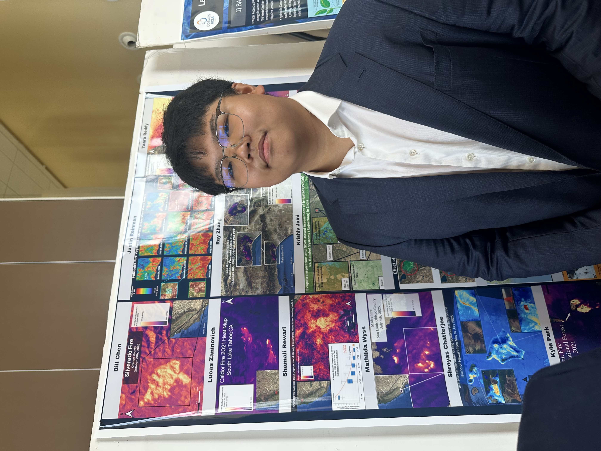
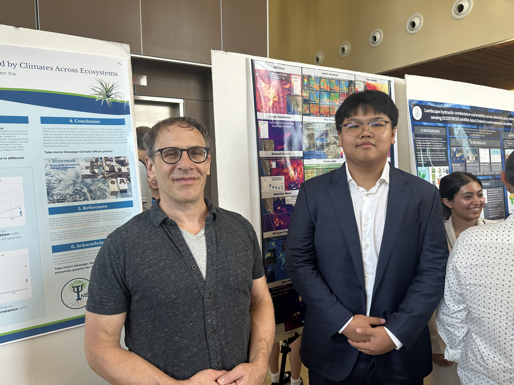
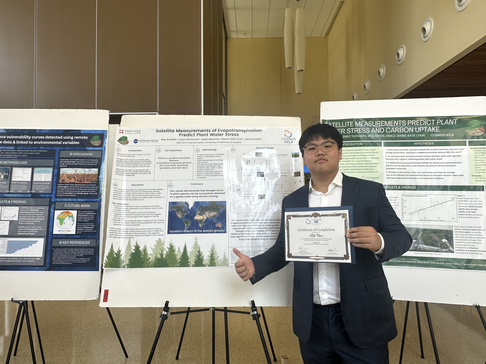

During the summer, I had the incredible opportunity to participate in the UCLA COSMOS program, where I engaged in hands-on scientific research and collaborated with fellow students passionate about STEM.

## Program Experience

The UCLA COSMOS program provided an immersive experience in scientific research and exploration. Throughout the program, I worked on various projects, attended lectures from leading researchers, and built lasting connections with peers from across California.

## Photo Gallery

Here are some memorable moments from my time at UCLA COSMOS:

### Method 1: Simple Image Grid (Markdown)

### Method 2: Two-Column Layout

  

    
    
Campus Life

  

  

    
    
Research Sessions

  

  

    
    
Laboratory Work

  

  

    
    
Collaborative Projects

  

### Method 3: Single Column with Captions

<figure style="margin: 2rem 0;">
  
  <figcaption style="text-align: center; margin-top: 1rem; font-style: italic; color: #666;">Exploring the beautiful UCLA campus during the COSMOS program</figcaption>
</figure>

<figure style="margin: 2rem 0;">
  
  <figcaption style="text-align: center; margin-top: 1rem; font-style: italic; color: #666;">Engaging in hands-on research activities</figcaption>
</figure>

<figure style="margin: 2rem 0;">
  
  <figcaption style="text-align: center; margin-top: 1rem; font-style: italic; color: #666;">Working in the laboratory with cutting-edge equipment</figcaption>
</figure>

<figure style="margin: 2rem 0;">
  
  <figcaption style="text-align: center; margin-top: 1rem; font-style: italic; color: #666;">Building connections with fellow COSMOS participants</figcaption>
</figure>

## Key Takeaways

The UCLA COSMOS program was a transformative experience that:
- Enhanced my understanding of scientific research methodologies
- Provided exposure to advanced laboratory techniques
- Connected me with mentors and peers passionate about STEM
- Strengthened my commitment to pursuing scientific research

> [!NOTE]
> This program significantly influenced my academic interests and career aspirations in science and research.

## Looking Forward

The skills and knowledge I gained at UCLA COSMOS continue to inspire my academic pursuits and research interests. The connections I made and the experiences I had will undoubtedly shape my future in STEM.
