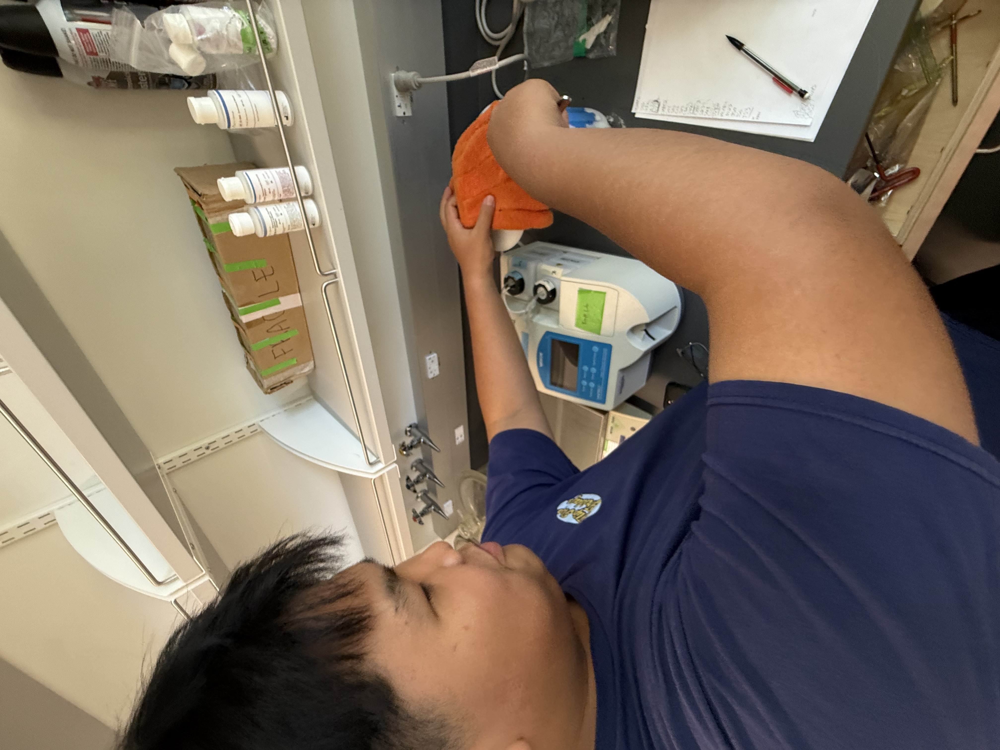
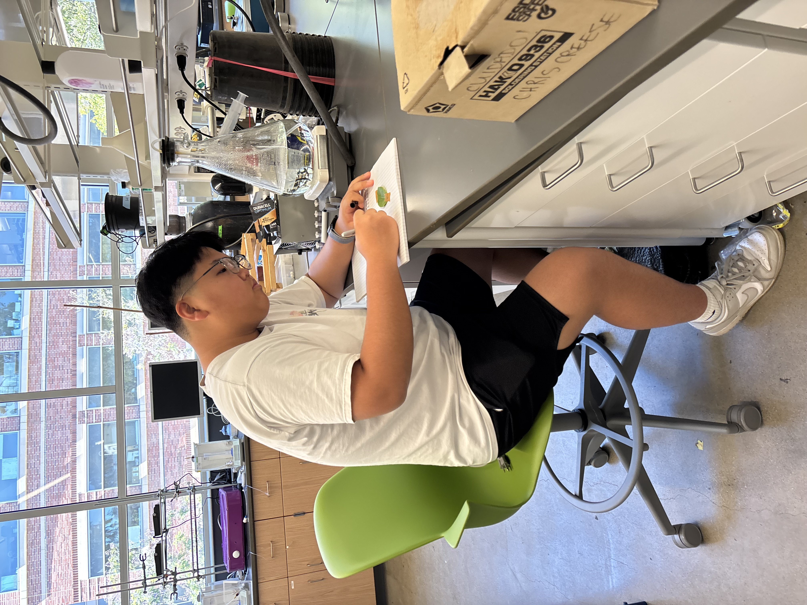

As a UCLA Joint Science Researcher, I have had the privilege of participating in advanced scientific research, working alongside faculty and graduate students to explore complex scientific questions and contribute to ongoing research projects.

## Research Experience

My role as a joint science researcher at UCLA has provided me with hands-on experience in laboratory techniques, data analysis, and scientific methodology. This opportunity has deepened my understanding of the research process and strengthened my commitment to pursuing scientific inquiry.

## Research Highlights

Throughout this research experience, I have:

- Collaborated with UCLA faculty and research teams
- Conducted experiments and collected data using advanced laboratory equipment
- Analyzed research findings and contributed to project outcomes
- Developed critical thinking and problem-solving skills in a research environment
- Gained exposure to cutting-edge scientific methodologies and technologies

## Photo Gallery

Here are some memorable moments from my research experience at UCLA:

<figure style="margin: 2rem 0;">
  
  <figcaption style="text-align: center; margin-top: 1rem; font-style: italic; color: #666;">Working in the state-of-the-art research laboratory at UCLA</figcaption>
</figure>

<figure style="margin: 2rem 0;">
  
  <figcaption style="text-align: center; margin-top: 1rem; font-style: italic; color: #666;">Utilizing advanced scientific instruments for data collection and analysis</figcaption>
</figure>

<figure style="margin: 2rem 0;">
  
  <figcaption style="text-align: center; margin-top: 1rem; font-style: italic; color: #666;">Collaborating with research mentors and team members on experimental procedures</figcaption>
</figure>

<figure style="margin: 2rem 0;">
  
  <figcaption style="text-align: center; margin-top: 1rem; font-style: italic; color: #666;">Presenting research findings and discussing methodologies with faculty advisors</figcaption>
</figure>

<figure style="margin: 2rem 0;">
  
  <figcaption style="text-align: center; margin-top: 1rem; font-style: italic; color: #666;">Setting up experimental apparatus for controlled scientific investigations</figcaption>
</figure>

<figure style="margin: 2rem 0;">
  
  <figcaption style="text-align: center; margin-top: 1rem; font-style: italic; color: #666;">Analyzing experimental data and contributing to research conclusions</figcaption>
</figure>

## Skills Developed

This research experience has helped me develop essential skills for scientific inquiry:

- **Technical Proficiency**: Mastery of laboratory equipment and experimental techniques
- **Analytical Thinking**: Critical evaluation of data and research outcomes
- **Collaboration**: Working effectively within a diverse research team
- **Scientific Communication**: Presenting findings and discussing research with peers and mentors
- **Problem-Solving**: Addressing experimental challenges and adapting methodologies

## Impact and Learning

Participating as a UCLA Joint Science Researcher has been transformative for my academic and professional development. The experience has:

- Reinforced my passion for scientific research
- Provided practical application of theoretical knowledge
- Connected me with mentors and researchers in the field
- Enhanced my understanding of the scientific method and research ethics
- Prepared me for future academic pursuits in STEM

> [!NOTE]
> This research experience at UCLA has been instrumental in shaping my academic interests and career aspirations in scientific research.

## Looking Forward

The skills, knowledge, and connections I've gained through this research opportunity continue to influence my academic trajectory. This experience has solidified my commitment to pursuing advanced scientific research and contributing to the broader scientific community.
