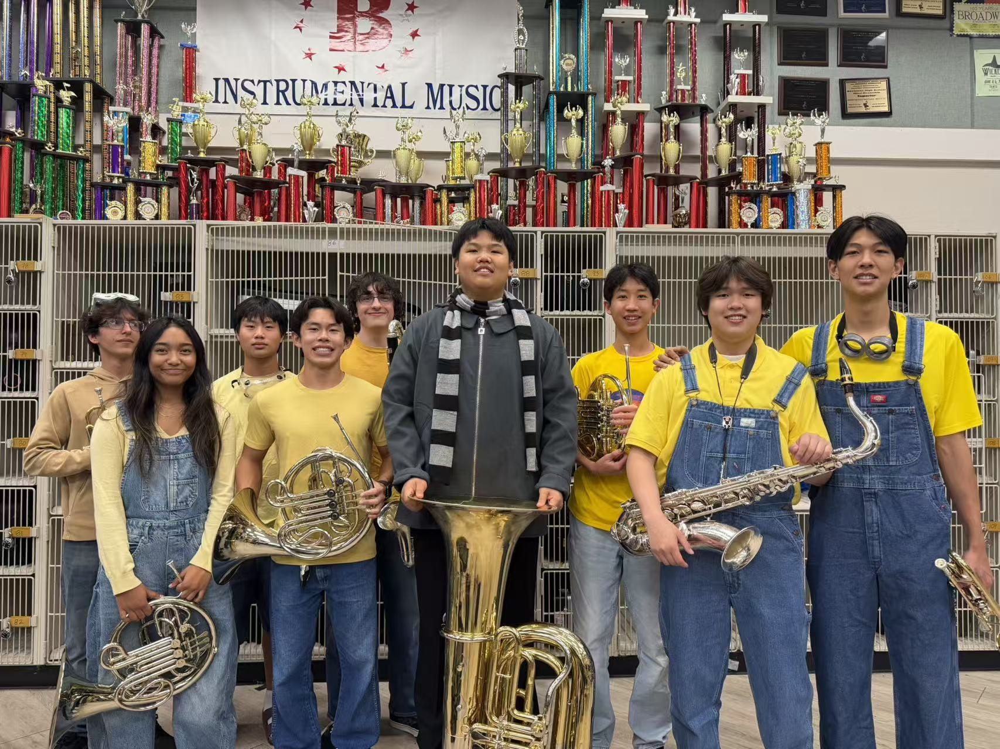

Throughout my four years of high school, music has been an integral part of my life, serving as both a creative outlet and a platform for community service. I've dedicated approximately 7 hours per week, 40 weeks per year to various musical pursuits and leadership roles.

## Harmony Sounds Outreach

### Founder and President

I founded **Harmony Sounds Outreach**, a student-led initiative dedicated to bringing the joy of music to elderly community members. As Founder and President, I:

- Established and led the organization from the ground up
- Organized regular performances at senior centers and retirement communities
- Successfully raised over **$1,000** to support our outreach activities
- Coordinated with local venues and community partners
- Built a team of dedicated student musicians committed to service

The experience of connecting with elderly audiences through music has been incredibly rewarding, teaching me about leadership, community engagement, and the universal power of music to bridge generational gaps.

<figure style="margin: 2rem 0;">
  
  <figcaption style="text-align: center; margin-top: 1rem; font-style: italic; color: #666;">Performing at senior centers through Harmony Sounds Outreach - bringing music to elderly community members</figcaption>
</figure>

## Performance Ensembles

### All-State Band

Selected for the prestigious **California All-State Band**, representing the top student musicians across the state. This honor recognized my dedication to musical excellence and provided opportunities to perform with the finest young musicians in California.

### Tustin Unified School District Honor Band

As a member of the **Tustin Unified School District Honor Band**, I performed in elite ensembles showcasing the district's most accomplished musicians. This experience enhanced my technical skills and collaborative abilities.

### Wind Ensemble - 1st Chair Tuba

Earned and maintained the position of **1st Chair Tuba** in my school's top Wind Ensemble throughout my high school career. This leadership role involved:

- Performing challenging repertoire at the highest level
- Setting the standard for the tuba section
- Mentoring other brass players
- Contributing to ensemble balance and interpretation

### Low Brass Section Leader

As **Low Brass Section Leader**, I took on additional responsibilities beyond my chair position:

- Led sectional rehearsals for tubas, euphoniums, and trombones
- Provided technical guidance and musical direction
- Fostered team cohesion and collaborative spirit
- Served as liaison between section members and conductors

<figure style="margin: 2rem 0;">
  
  <figcaption style="text-align: center; margin-top: 1rem; font-style: italic; color: #666;">Performing as 1st Chair Tuba with the Wind Ensemble on stage</figcaption>
</figure>

<figure style="margin: 2rem 0;">
  
  <figcaption style="text-align: center; margin-top: 1rem; font-style: italic; color: #666;">Low Brass Section with music peers</figcaption>
</figure>

## Musical Achievement

### MTAC Level 10 - Euphonium

Achieved **Music Teachers' Association of California (MTAC) Level 10 certification** on euphonium, the highest level in the MTAC Certificate of Merit program. This accomplishment demonstrates:

- Advanced technical proficiency
- Comprehensive music theory knowledge
- Sight-reading excellence
- Performance mastery across diverse repertoire

## Impact and Growth

My involvement in these musical activities over four years (grades 9-12) has shaped my character and skills in profound ways:

- **Leadership**: Developed strong leadership abilities through founding Harmony Sounds Outreach and serving as section leader
- **Dedication**: Maintained consistent commitment with year-round participation
- **Community Service**: Created meaningful connections through music outreach to elderly populations
- **Musical Excellence**: Achieved recognition at district and state levels
- **Teamwork**: Collaborated with diverse groups of musicians in various ensemble settings

> [!NOTE]
> These experiences have reinforced my belief in music's power to bring people together and create positive change in communities.

## Looking Forward

The skills I've developed through music—discipline, collaboration, leadership, and creative expression—continue to influence my approach to all areas of life. The connections made and lessons learned through these musical endeavors will undoubtedly guide my future pursuits, whether in music, community service, or beyond.
