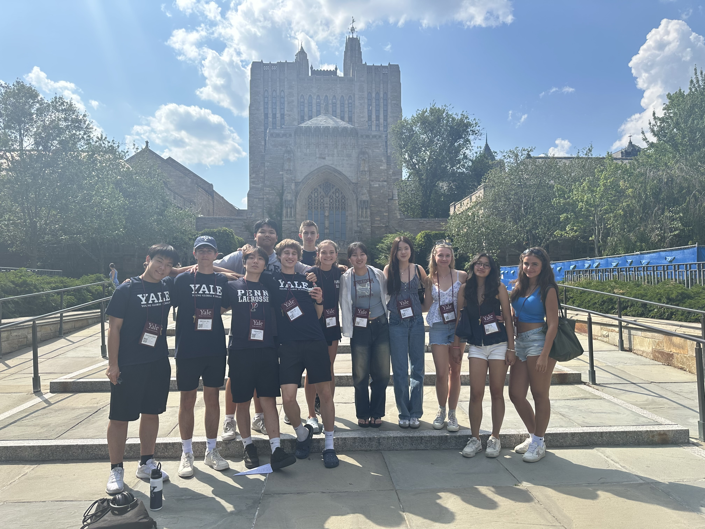

As a **Speaker and Scholar** at the prestigious Yale Young Global Scholars (YYGS) program, I participated in an intensive two-week session focused on **Solving Global Challenges**. This transformative experience at Yale University brought together exceptional students from around the world to explore pressing global issues and develop innovative solutions.

## Program Overview

Yale Young Global Scholars is a highly competitive academic enrichment program that provides outstanding high school students with the opportunity to engage in rigorous academic coursework, collaborate with peers from diverse backgrounds, and learn from Yale faculty and global leaders.

During my time at YYGS, I immersed myself in:
- **50 hours per week** of intensive academic activities
- **2 weeks** of collaborative learning and global engagement
- Interdisciplinary discussions on environmental challenges
- Leadership development and global citizenship training

## Featured Speaker Role

### YYGS Speaker Series - Plastic Pollution Talk

One of the highlights of my YYGS experience was being selected to deliver a **featured talk on plastic pollution** for the Pierson School through the **YYGS Speaker Series**. This opportunity allowed me to:

- Present research and insights on global plastic pollution challenges
- Share innovative solutions for reducing plastic waste
- Engage with the Yale community on environmental sustainability
- Demonstrate leadership in environmental advocacy

The speaker series provided a platform to address one of the most critical environmental challenges of our time and contribute to the broader dialogue on sustainable practices.

## Academic Engagement

### Leading Discussions on Environmental Challenges

Throughout the program, I took an active leadership role by:

- **Leading discussions** on pressing environmental challenges facing our planet
- Facilitating collaborative problem-solving sessions with international peers
- Analyzing case studies on climate change, resource management, and sustainability
- Developing policy recommendations for environmental conservation
- Engaging with Yale faculty experts on environmental science and policy

These discussions fostered critical thinking and cross-cultural understanding while addressing real-world global challenges.

## Photo Gallery

Memorable moments from my Yale Young Global Scholars experience:

<figure style="margin: 2rem 0;">
  
  <figcaption style="text-align: center; margin-top: 1rem; font-style: italic; color: #666;">Exploring Yale University's historic campus and world-class facilities</figcaption>
</figure>

<figure style="margin: 2rem 0;">
  
  <figcaption style="text-align: center; margin-top: 1rem; font-style: italic; color: #666;">Engaging in intensive seminar discussions on global challenges and solutions</figcaption>
</figure>

<figure style="margin: 2rem 0;">
  
  <figcaption style="text-align: center; margin-top: 1rem; font-style: italic; color: #666;">Delivering my featured talk on plastic pollution for the YYGS Speaker Series at Pierson School</figcaption>
</figure>

<figure style="margin: 2rem 0;">
  
  <figcaption style="text-align: center; margin-top: 1rem; font-style: italic; color: #666;">Collaborating with fellow global scholars from diverse backgrounds and cultures</figcaption>
</figure>

<figure style="margin: 2rem 0;">
  
  <figcaption style="text-align: center; margin-top: 1rem; font-style: italic; color: #666;">Building lasting connections with the Yale Young Global Scholars community</figcaption>
</figure>

## Skills and Leadership Development

My YYGS experience cultivated essential skills for global leadership:

- **Public Speaking**: Delivering presentations to diverse, international audiences
- **Cross-Cultural Communication**: Collaborating with scholars from over 100 countries
- **Critical Analysis**: Evaluating complex global challenges from multiple perspectives
- **Environmental Advocacy**: Championing sustainable solutions to pressing ecological issues
- **Leadership**: Facilitating discussions and guiding collaborative problem-solving

## Key Takeaways

The Yale Young Global Scholars program was an intensive and transformative experience that:

- Connected me with exceptional peers and mentors from around the world
- Deepened my understanding of global environmental challenges
- Provided a platform to share my voice on plastic pollution and sustainability
- Strengthened my commitment to environmental stewardship and global citizenship
- Exposed me to Yale's academic rigor and intellectual community

> [!NOTE]
> This program reinforced my dedication to addressing global environmental challenges and inspired me to continue advocating for sustainable solutions.

## Impact on Future Goals

The intensive two-week YYGS experience has profoundly influenced my academic and career aspirations:

- **Global Perspective**: Gained nuanced understanding of interconnected global challenges
- **Environmental Focus**: Solidified my commitment to environmental science and policy
- **Leadership Confidence**: Developed skills to lead discussions and inspire action
- **Academic Preparation**: Experienced Yale-level academic rigor and intellectual discourse
- **Network**: Built lasting relationships with future global leaders

## Looking Forward

The connections made, skills developed, and insights gained at Yale Young Global Scholars continue to shape my approach to problem-solving and global citizenship. This experience has prepared me to contribute meaningfully to addressing the environmental challenges that define our generation.
