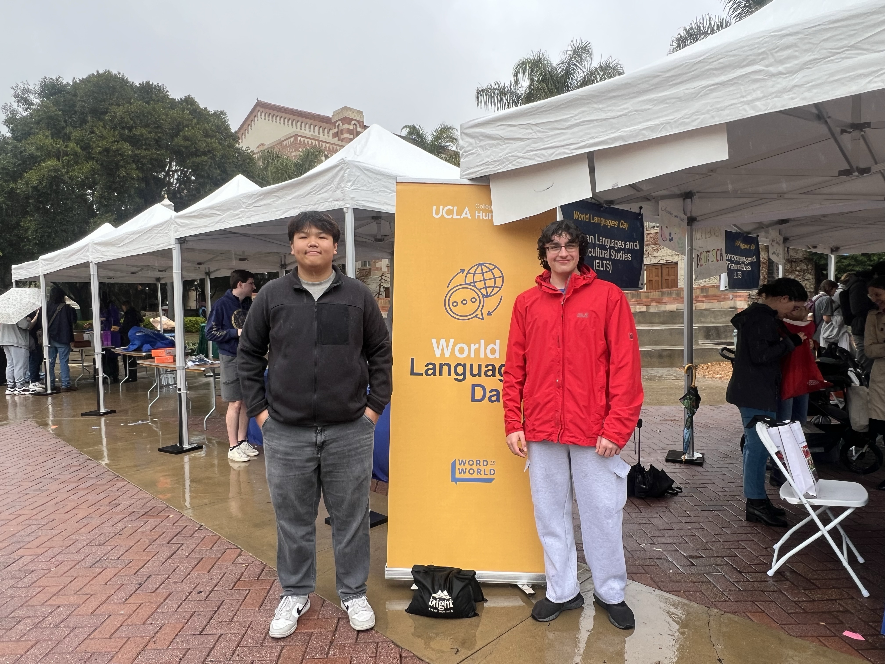
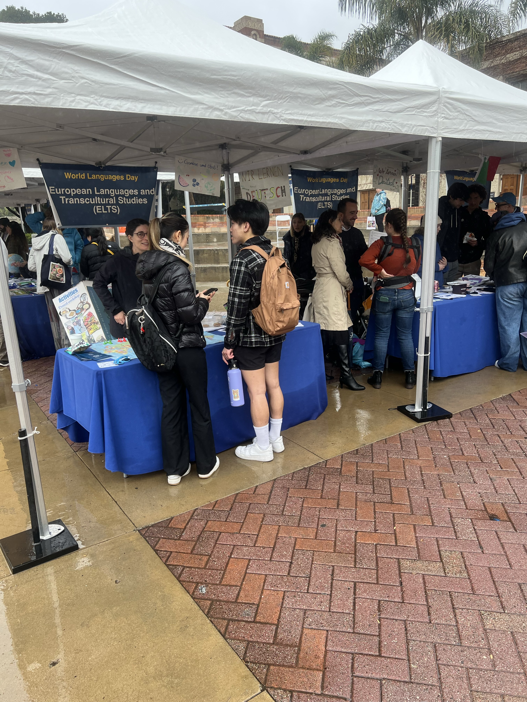
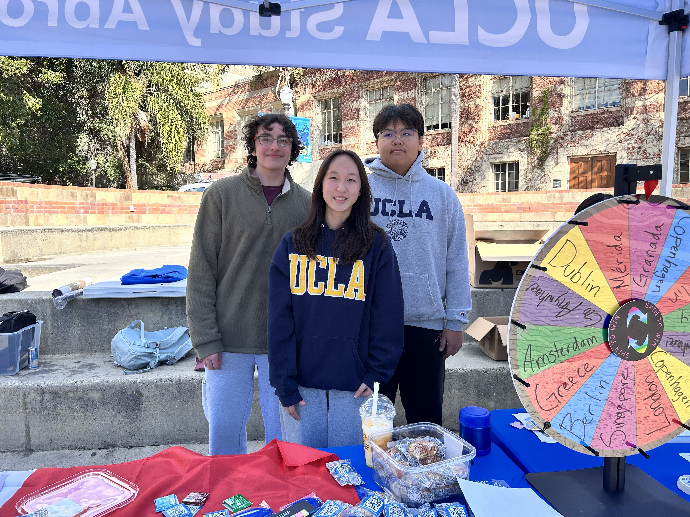

As the **Founder and CEO of Lingua Harmonia**, I created a student-led linguistics organization dedicated to promoting **language diversity, cross-cultural communication, and equitable access to language learning**.  
Our team provides **free tutoring and educational workshops** for underserved youth to explore the relationship between **language, identity, and culture**.

In collaboration with **Dr. Nina Bjekovic** from the **UCLA Department of Linguistics**, I conducted research on **language diversity and sociolinguistic variation**, integrating field study observations into Lingua Harmonia’s outreach curriculum.

- **Position/Leadership (≤50):** CEO of Lingua Harmonia & Linguistics Researcher  
- **Organizations:** UCLA Department of Linguistics; Lingua Harmonia  
- **Description (≤150):** Collaborated with UCLA Dr. Nina Bjekovic to study language diversity; founded Lingua Harmonia to tutor underserved youth and raise cultural awareness.  
- **Participation:** Grades **11, 12, Continuing** — **All Year**  
- **Hours:** ~6 hrs/week × 35 weeks/year  

---

## Program Highlights

Through Lingua Harmonia, I have:
- Designed bilingual tutoring materials in **English, Mandarin, and Spanish**
- Led community workshops on **language identity and sociolinguistics**
- Partnered with UCLA students and linguists for guest lectures
- Organized cultural exchange activities connecting **youth with multilingual mentors**

This work combines **academic research and public outreach**, showing how linguistic diversity can strengthen community understanding and empathy.

---

## Photo Gallery

<figure style="margin: 2rem 0;">
  
  <figcaption style="text-align: center; margin-top: 1rem; font-style: italic; color: #666;">
    Founding event of Lingua Harmonia at UCLA — promoting multilingual education.
  </figcaption>
</figure>

<figure style="margin: 2rem 0;">
  
  <figcaption style="text-align: center; margin-top: 1rem; font-style: italic; color: #666;">
    Presenting Lingua Harmonia at a UCLA language diversity fair.
  </figcaption>
</figure>

<figure style="margin: 2rem 0;">
  
  <figcaption style="text-align: center; margin-top: 1rem; font-style: italic; color: #666;">
    Outreach booth with UCLA linguistics mentors to raise awareness on language diversity.
  </figcaption>
</figure>

---

## Activity Summary (for Applications)

**CEO of Lingua Harmonia and Linguistics Researcher**  
Collaborated with UCLA Dr. Nina Bjekovic to study language diversity; founded Lingua Harmonia to tutor underserved youth and raise cultural awareness.  
Grades 11–12, Continuing • 6 hrs/week • 35 weeks/year • All Year

---

## Impact

- Promoted **language equity and inclusion** across student communities  
- Created **accessible linguistics education** for underrepresented youth  
- Strengthened **academic collaboration** between UCLA and high school linguistics learners  
- Fostered cross-cultural empathy and global awareness

> This initiative combines **linguistics research and educational outreach**, turning academic insight into real-world impact.
